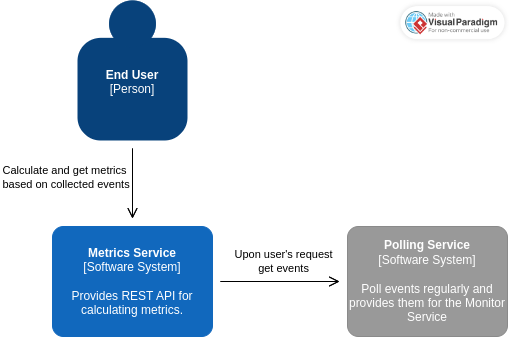

# HOW TO RUN

### 1. Prepare .env file

Create a .env file from template:
```bash
cp .env.template .env
```

Fill in the `GITHUB_TOKEN` and `PORT`.

**Note**: You can leave default values (for `GITHUB_TOKEN` leave it blank). By providing the token,
you increase the number of allowed requests per second for GitHub API (60 per hour without token,
5000 with token). Thus, decresing the number of missed events.

### 2. Start service in container

To start the service, simply run:
```bash
docker compose up -d
```

The `docker-compose.yml` specifies the REST API service. It reads the `.env` file to configure the
container to user's liking. In addition, docker compose will build the Docker image as is specified
in `Dockerfile`.


# HOW IT WORKS

Briefly, the Flask service provides REST APIs as specified in the assignment and bonus endpoint
which tracks the repositories that were made public. The track of public repositories is possible
thanks to the `PublicEvent` which is created every time the private repository is made public. 
In addition to the service, a thread is spawned which polls the events from the GitHub API.
Regarding events polling, the GitHub API restrics the number of requests for each user (based on IP
or token). That means that it is not possible to obtain all events ever created.

It is important to note that each poll for events consists of 3 requests. This is because the result
is paginated and the API limits page size to 100. At each time, the API provides 300 records, thus
3 requests are needed to get all 3 pages.

### Diagram


## POSSIBLE IMPROVEMENTS

Currently, the big limitations of this solution is that it cannot scale. Because the spawned thread,
which polls events, is created during service initialization. Creating more clones of service
(by increasing workers count of `gunicorn` or creating more Docker containers) will create more
polling threads. This will cause a quick exhaustion of the GitHub API requests limit, without providing
more value (as each thread polls the same events).

To improve scalability I would create a new service which would handle only polling of events. This
service would provide polled events either through API, or would save them to for example REDIS
container. As a result we could have multiple clones of metrics services handling users' requests
with a single polling service.
